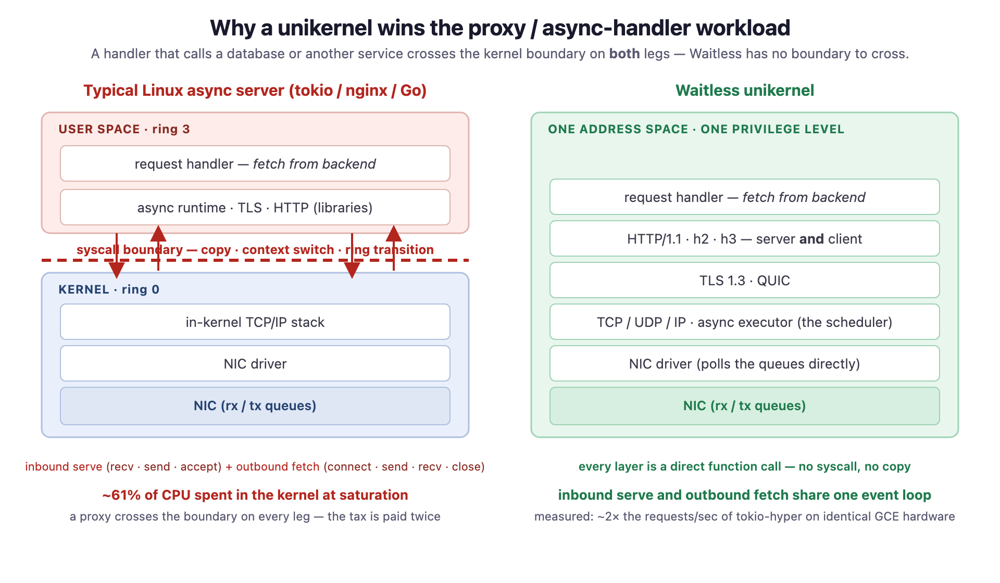

# Waitless

[](#license)

**Waitless is a bare-metal unikernel** — a Rust application that boots on real
(or virtual) hardware as the *entire* software stack. There is no Linux
underneath, no kernel/user split, and no syscalls. The network stack, TLS,
HTTP, and your request handlers all run in a single address space, at one
privilege level, driven by one cooperative `async` runtime.

The name is the thesis, twice over. **Wait**less: `async fn` *is* the
scheduler, so a handler that blocks on I/O parks for free and the core moves
on — no thread pool, no syscall to wait. **Weight**less: the whole bootable
system — OS, TCP/IP, TLS 1.3, HTTP/1.1, HTTP/2, HTTP/3, QUIC — is a **1.5 MB**
image (a hello-world is **428 KB**), smaller than the base layer of a typical
Linux container and with nothing else inside it.

The payoff is measurable. On identical Google Compute Engine hardware with the
same NIC, Waitless serves **~2× the requests/sec of tokio-hyper** — the
mainstream Rust async server — and **up to ~2× native Linux** (see
[Performance](#performance)). Not because the drivers are better (Linux's are
vastly more mature) but because the architecture deletes the syscall boundary,
the user/kernel copies, and the context switches outright.

## The workload this is built for

Most "fast web server" benchmarks serve a static byte string and measure how
little overhead the framework adds. Real services rarely do that — a real
handler **calls a database, a cache, or another microservice** and waits on
the answer. That is exactly where a unikernel pulls away:



On Linux, an API gateway or backend-for-frontend pays the syscall tax **twice**
per request — once accepting and answering the client, once connecting to and
reading from the upstream. Profiled at saturation, tokio-hyper spends **~61 %
of its CPU inside the kernel** doing exactly this: `epoll`, `recv`/`send`, the
in-kernel TCP/IP stack, and a user↔kernel copy on every packet. Waitless has no
kernel to call — the inbound serve and the outbound fetch run in the same event
loop, in the same address space, as plain function calls. The advantage that is
~2× for a static response is *larger* for a handler that does I/O, because there
is simply more syscall tax to delete.

[`apps/gateway`](apps/gateway) is that handler, in ~50 lines — see
[The async-handler showcase](#the-async-handler-showcase) below.

## Highlights

- **No OS underneath.** Boots straight into your app. I/O is direct function
  calls, not syscalls — no ring transitions, no context switches, no copies
  across a kernel boundary.
- **Async *is* the scheduler.** `async fn` is the only execution model; a
  per-core cooperative executor polls connection handlers directly. No
  preemption, no locks, no second scheduling layer. A handler awaiting a
  database or upstream parks for almost nothing.
- **A real network stack, hand-rolled in `#![no_std]` Rust.** Ethernet,
  ARP/NDP, IPv4/IPv6, UDP, a conformance-tracked TCP (window scaling, SACK,
  CUBIC, RACK, TLP), TLS 1.3, and **HTTP/1.1, HTTP/2, and HTTP/3 over QUIC** —
  each as both a **server and a client**.
- **Weightless.** The full web server image is 1.5 MB; an app pulls in only the
  protocols and drivers it declares, and unused code never compiles in.
- **Two architectures, four ways to run.** x86_64 and aarch64 — on QEMU,
  Apple's hypervisor, a bootable ISO, and GCE — the same app, no source changes.
- **Faster than Linux on the same hardware.** [~2× tokio-hyper, up to ~2×
  native Linux](#performance), measured on identical GCE VMs and NIC.

## Performance

All figures are from Google Compute Engine with **gVNIC**, benched from a
separate VM over the VPC — same NIC, same client, no loopback shortcut and no
lighter network stack underneath. And **Linux runs its mature in-tree `gve`
driver** (thousands of lines, years of tuning); **Waitless runs the
from-scratch gVNIC driver in [`crates/drivers/gve/`](crates/drivers/gve/)**.
Linux should win on driver maturity alone. It doesn't.

> Absolute GCE throughput carries **~15–20 % run-to-run variance** on SPOT
> hardware; treat single-run absolutes as indicative and lean on the **ratios**
> (measured back-to-back, same loadgens). Full methodology, caveats, and the
> efficiency baselines are in
> [docs/benchmark-results.md](docs/benchmark-results.md).

### vs. a real async server (tokio-hyper) — c3 / gVNIC, byte-identical `/health`

Same language, same async model, same TLS lineage — the only difference is
Linux vs bare metal. Each server measured at its own CPU-bound ceiling:

| Workload | **Waitless** | tokio-hyper | Speedup |
|----------|-------------:|------------:|:-------:|
| HTTP/1.1 plain  | **≈ 1.0–1.2 M** rps\* | ≈ 398 K rps | **≈ 2.5–3×** |
| HTTPS / TLS 1.3 | **≈ 610–730 K** rps  | ≈ 338 K rps | **≈ 1.8–2.2×** |
| TLS p50 latency @200 conns | **270 µs** | 587 µs | **2.2× lower** |

\* lower bound — Waitless was still loadgen-limited even with two load
generators. At 200 connections (neither server saturated) tokio-hyper is already
at ~97 % of its ceiling while Waitless sits below 50 % of its — so Waitless
delivers ~2× lower latency *and* ~2× more headroom. The reason is stark:
tokio-hyper burns ~61 % of its CPU in the kernel; Waitless has no kernel to call.

### vs. native Linux (same app, earlier n2 run)

The *same* application compiled for Linux/POSIX vs as a Waitless unikernel:

| Workload            | Native Linux | **Waitless** | Δ |
|---------------------|-------------:|-------------:|:-:|
| `/health`      c128 |    278,000   |  **499,000** | **+79 %**  |
| `/health`      c256 |    255,000   |  **514,000** | **+102 %** |
| `health_tls_max`    |    183,700   |  **294,500** | **+60 %**  |
| `udp_peak` (pkt/s)  |    566,500   |  **787,000** | **+39 %**  |

`/health` doubles at `c256` because the per-packet syscall overhead gap widens
as the connection count grows — the high-concurrency regime is where the
architecture wins most.

### Weightless — the whole stack, measured

| Image (entire bootable system) | x86_64 | aarch64 |
|--------------------------------|-------:|--------:|
| `apps/hello` (HTTP hello-world)            | 428 KB | 364 KB |
| `apps/webserver` (HTTP/1.1+2+3, TLS, QUIC, diagnostics) | 1.5 MB | 1.2 MB |

There is no kernel, init, libc, or container base image underneath these
numbers — that *is* the whole thing, bootable. `--gc-sections` plus
deps-as-features means an app links only the protocols it names.

Reproduce with `scripts/bench.py`; see
[docs/benchmarking.md](docs/benchmarking.md) for the methodology.

## Quick Start

```bash
# Prerequisites: Bazel and QEMU.
#   macOS:  brew install bazel qemu
#   Linux:  your distro's bazel (or bazelisk) + qemu-system packages

# Boot the demo web server as a unikernel:
bazel run //apps/webserver:webserver_hvf          # macOS — Apple Hypervisor
bazel run //apps/webserver:webserver_qemu_x86_64  # elsewhere — QEMU

# Then, from another terminal:
curl http://localhost:8080/health
```

## The async-handler showcase

[`apps/gateway`](apps/gateway/src/main.rs) is a reverse proxy / API gateway: on
every request the handler makes an outbound HTTP request to a backend and
relays the result — the "my handler calls a database / another service"
pattern, and the showcase for Waitless's **client** roles. The handler
suspends on the round-trip like any other `await`, and the per-core event loop
keeps serving other connections while it is parked.

```rust
async fn gateway(req: &mut Request<'_>, res: &mut Response<'_>) -> Result<(), ()> {
    if req.path() == b"/health" {
        res.set(Response::ok(b"application/json", b"{\"status\":\"ok\"}"));
        return Ok(());
    }
    // One outbound HTTP/1.1 GET to the backend, bounded body + deadline.
    // `http::client::get` connects, sends, parses the response, reads the
    // body — all syscall-free, in this same event loop.
    match http::client::get(backend_ip, 80, b"backend", req.path(), 256 * 1024).await {
        Ok((head, body)) => { res.set(Response::ok(b"application/octet-stream", body));
                              res.status(head.status as i32); Ok(()) }
        Err(_) => { res.set(Response::ok(b"text/plain", b"502 Bad Gateway\n"));
                    res.status(502); Ok(()) }
    }
}
```

The client API is uniform across protocols — `http::client`, `https::client`
(ALPN-negotiated h2/h1.1, or pinned `get_h1`), and `http3::client` — each
exposing the same `connect` / `get` / `fetch` verbs.

## Feature set

A research stack, but a broad and real one. Everything below is implemented and
tested (`bazel test //...`); see [Current gaps & limits](#current-gaps--limits)
for what is deliberately deferred or not yet built.

**Boot & platform**
- x86_64 (Multiboot2 / Limine) and aarch64 (Limine); QEMU, Apple HVF, bootable
  Limine ISO, GCE, and a POSIX-sockets `native` variant — same app, no source
  changes.
- SMP: one worker per vCPU; per-core RX/TX queue pairs with Toeplitz RSS on
  gVNIC so a flow stays on its core (zero software distribution).

**Async runtime**
- `async fn`-only cooperative executor; per-core, lock-free, no preemption.
- Structural cancellation safety (RAII waker registration — a dropped/`select`-
  cancelled future deregisters cleanly); per-core timer wheel with a mockable
  clock seam for deterministic simulation.

**NIC drivers (from scratch)**
- `virtio-net` (PCI + MMIO, multi-queue) and Google `gve`/gVNIC (DQO + GQI).
- Offloads: TSO, UDP-GSO (QUIC), RSC/GRO, RSS; zero-copy RX and TX.

**L2 / L3**
- Ethernet, ARP (with active resolution for outbound connects), IPv6 NDP,
  IPv4 & IPv6, DHCP, ICMP, and ICMP-driven PMTUD (RFC 1191/8201 with RFC 5927
  anti-spoof gating).

**TCP** — conformance-tracked, server and client
- Full RFC 9293 state machine incl. **active open** (`connect`, core-affine
  ephemeral ports); RFC 6298 RTO with Karn; RFC 5681 + RFC 6928 IW10; window
  scaling (RFC 7323); SACK (RFC 2018) + sender-side RFC 6675 recovery;
  out-of-order reassembly; **CUBIC** + NewReno (shared `net_cc` core);
  **Tail Loss Probe** + **RACK** time-based loss detection; peer-MSS honoring;
  RFC 5961 challenge-ACK hardening.

**UDP / QUIC** (RFC 9000/9001/9002) — server and client
- Streams + flow control, loss recovery + NewReno congestion control + token-
  bucket pacing, key update, path validation & migration (auth-gated),
  RESET_STREAM / STOP_SENDING, client-side Retry-integrity & CID-echo
  authentication, version-negotiation handling.

**TLS 1.3** — server and client
- X25519 KEX, ECDSA P-256 certs, `TLS_AES_128_GCM_SHA256`, ALPN; server-side
  1-RTT session resumption; client-side **SPKI pinning** for server auth.
- In-tree AEAD (AES-GCM), HKDF key schedule, transcript — KAT-tested.

**HTTP** — server and client for all three versions
- **HTTP/1.1**: streaming request *and* response bodies, chunked coding,
  keep-alive.
- **HTTP/2**: HPACK, full flow control + multiplexing, the DoS hardening suite
  (Rapid-Reset, HPACK-bomb, CONTINUATION-flood, frame-flood, MAX_CONCURRENT_STREAMS).
- **HTTP/3**: RFC 9114 framing + QPACK (static table) over QUIC.
- One transport-erased handler signature serves every version; `https::serve`
  brings up h1.1 + h2 + h3 on one port with automatic `Alt-Svc`, and
  `https::client` is its outbound mirror.

**Two-endpoint deterministic simulation**
- The client and server roles let a real client talk to a real server in one
  process under a virtual clock and a seeded lossy pipe — loss-recovery
  correctness that used to need a cloud VM + `tc netem` now runs as a
  reproducible in-repo test.

**Observability & operations**
- A unified `/obs` endpoint (per-core cycle counters, per-subsystem diagnostics);
  shared congestion-control core; per-core DRR egress scheduler; admission
  control; a hardened production RNG (SHA-256 Hash_DRBG, SP 800-90A reseed,
  multi-source HW entropy, SP 800-90B health tests).

**Build system**
- Bazel with **deps-as-features**: each protocol/driver is a target; the app's
  `deps` list determines what compiles in. Variant targets per runner; usable
  as a Bazel module from another repo.

## Current gaps & limits

Waitless is a single-author research project, not production software. The API
is unstable and the checked-in dev certificate and several defaults are
development-only. Known gaps, honestly:

**Functional / not yet built**
- **HTTP client: no connection pooling or redirects** — each outbound request
  is a fresh connection (`Connection: close`). This is the main reason the
  proxy *throughput* head-to-head vs. a pooled nginx/tokio gateway is future
  work: the architecture predicts a win (above), but pooling must land first to
  measure it cleanly.
- **IPv6 active open** (outbound `connect`) is IPv4-only so far.
- **TLS client**: SPKI-pin or skip-verify only — no web-PKI chain validation,
  no HelloRetryRequest, no client-side resumption/0-RTT.
- **QUIC**: no CID rotation or self-initiated path challenge; a few transport
  parameters parsed-but-unused; a non-1-RTT RESET/STOP is dropped rather than
  closed as a §12.4 violation.
- **HTTP/3**: QPACK static-table only (no dynamic table); peer SETTINGS parsed
  but not all enforced.

**Performance parity (Linux has these; we don't yet)**
- BBR and a TCP-layer pacer; RACK's adaptive reorder window; TCP Timestamps/PAWS.
- gVNIC RSS steering for *client* connections (server flows are steered; a
  counter tracks the wrong-core case).

**Hardening / robustness**
- No inbound IP-fragment reassembly or software checksum verification (relies on
  NIC RX-csum offload); the x86 BSP boot stack lacks a guard page (AP stacks have
  them); ARP/NDP are learn-only.

**Assurance**
- `h2spec` and the QUIC Interop Runner (external suites) aren't wired into CI;
  receive-path fuzzing is smoke-level.

The canonical, severity-ranked index lives in
[docs/roadmap.md](docs/roadmap.md) ("Known gaps at a glance"); the long-term
architectural direction is in
[docs/architecture-audit.md](docs/architecture-audit.md).

## Build Configurations

`waitless_binary(name, app)` generates one runnable target per runner — pick
the variant by name, no `--config=` flags needed (see
[`bazel/rules/variants.bzl`](bazel/rules/variants.bzl)):

```bash
bazel run //apps/webserver:webserver_hvf            # aarch64 · Apple Hypervisor (macOS)
bazel run //apps/webserver:webserver_qemu_aarch64   # aarch64 · QEMU
bazel run //apps/webserver:webserver_qemu_x86_64    # x86_64  · QEMU
bazel run //apps/webserver:webserver_iso_x86_64     # x86_64  · Limine ISO (BIOS/UEFI) via QEMU
bazel run //apps/webserver:webserver_native         # POSIX sockets · no VM
```

The `*_native` variant builds the same app against host POSIX sockets — handy
for fast iteration and debugging without a hypervisor.

## Testing

```bash
# Full matrix — every applicable variant of every app. HVF tests auto-skip on Linux.
bazel test //...

# Filter by runner.
bazel test --test_tag_filters=hvf    //...
bazel test --test_tag_filters=qemu   //...
bazel test --test_tag_filters=native //...

# A single variant.
bazel test //apps/webserver:test_hvf
```

## Architecture

```
┌──────────────────────────────────────┐
│           Application                │  apps/{hello, gateway, webserver}
│         #[waitless::init]            │
├──────────────────────────────────────┤
│   Userspace protos (above facade)    │  crates/proto/{tls, http, http2,
│   server + client roles             │                http3, quic, https}
├──────────────────────────────────────┤
│ Facade (waitless — kernel↔userspace) │  crates/waitless/ + nested
│                                      │  macros, net, backend
├──────────────────────────────────────┤
│       Network Stack (below facade)   │  crates/net/ (tcp, udp, ip, stack,
│                                      │              cc — shared congestion ctrl)
├──────────────────────────────────────┤
│     Drivers (NIC + bus)              │  crates/drivers/ (bus, nic, virtio-net, gve)
├──────────────────────────────────────┤
│     Runtime substrate                │  crates/runtime/{platform, worker,
│                                      │                  executor}
├──────────────────────────────────────┤
│       Kernel (serial, mm, SMP...)    │  crates/kernel/{core, bare}
├──────────────────────────────────────┤
│        Boot / Entry                  │  crates/boot/
└──────────────────────────────────────┘
         x86_64          aarch64
     (Multiboot2/PVH)  (Linux Image/DTB)
```

See [docs/crates.md](docs/crates.md) for the full crate taxonomy and the
kernel↔userspace facade boundary.

## Writing an Application

A Waitless app is a `#![no_std]` Rust crate with an `async` entry point. Here
is [`apps/hello`](apps/hello) in full — bring up the network, serve one route:

```rust
#![no_std]
extern crate alloc;

use http::{Request, Response};
use waitless::net::Net;

async fn hello(_: &Request, _: &mut http::BodyReader<'_, waitless::runtime::TcpStream>) -> Response {
    Response::ok(b"text/plain", b"Hello from bare metal!\n")
}

#[waitless::init]
async fn init() {
    Net::up().await.expect("Net::up failed");
    http::listen(80, hello).expect("http bind");
}
```

`#[waitless::init]` marks the async entry point the runtime polls once the
kernel, drivers, and network are up. The crate's `BUILD.bazel` wires it to the
`waitless_binary` rule:

```python
load("@rules_rust//rust:defs.bzl", "rust_library")
load("//bazel/rules:waitless.bzl", "port_fwd", "waitless_binary")

rust_library(
    name = "app",
    srcs = ["src/main.rs"],
    crate_root = "src/main.rs",
    deps = [
        "//crates/proto/http",
        "//crates/waitless",
    ],
)

waitless_binary(
    name = "hello",
    app = ":app",
    drivers = ["//crates/drivers/virtio-net"],
    port_forwards = [port_fwd("tcp", guest = 80, host = 8080)],
)
```

For the outbound-request pattern see [`apps/gateway`](apps/gateway); for a
fuller server — HTTPS, multiple routes, HTTP/3, live diagnostics — see
[`apps/webserver`](apps/webserver).

## Using Waitless in another project

The `apps/` in this repo are examples; a real application lives in its own
repository and depends on Waitless as a **Bazel module**:

```python
module(name = "website", version = "0.0.0")

bazel_dep(name = "waitless", version = "0.1.0")
local_path_override(
    module_name = "waitless",
    path = "../waitless",
)
```

The app's `BUILD.bazel` then loads the rule from `@waitless` and builds exactly
like an in-tree app — labels into the dependency just take the `@waitless`
prefix. A consuming module must re-declare a few **root-module-only** Bazel
settings (the `rules_rust` version/patches and the Rust toolchain tags) that
don't propagate through the module graph;
[**docs/consuming-as-a-library.md**](docs/consuming-as-a-library.md) is the
complete, copy-pasteable checklist.

## Project Layout

```
waitless/
├── apps/
│   ├── hello/         Minimal HTTP hello-world (~25 LOC)
│   ├── gateway/       Reverse proxy — handler makes an outbound request (~50 LOC)
│   └── webserver/     Full demo — HTTP, HTTPS, HTTP/3, live diagnostics
├── crates/
│   ├── waitless/      Facade — the API apps program against (+ macros, net, backend)
│   ├── proto/         Userspace protocols (server + client) — http, http2, http3, quic, tls, https
│   ├── net/           Network stack — tcp, udp, ip, stack, cc (shared congestion control)
│   ├── drivers/       NIC + bus drivers — virtio-net, gve (gVNIC)
│   ├── runtime/       Async substrate — executor, worker, platform
│   ├── kernel/        Kernel library — serial, memory, SMP, per-core state
│   ├── crypto/        AEAD + crypto helpers
│   ├── util/          Zero-copy buffers and lock-free primitives
│   └── boot/          Arch entry, page tables, the Limine boot protocol
├── bazel/             Toolchains, platforms, and the waitless_binary rule
├── docs/              Architecture and subsystem deep-dives (+ assets/)
├── scripts/           Benchmark, deploy, and dev tooling
└── tools/hvf-runner/  Native macOS/arm64 HVF runner used by the dev loop
```

## Documentation

See **[docs/README.md](docs/README.md)** for the full, categorized index. Highlights:

- [docs/crates.md](docs/crates.md) — crate taxonomy and the kernel↔userspace facade boundary
- [docs/stack-architecture.md](docs/stack-architecture.md) — inter-layer contracts and the one-golden-path direction
- [docs/architecture-audit.md](docs/architecture-audit.md) — the long-term architectural direction (7 system-level bets)
- [docs/networking.md](docs/networking.md) — the network stack, end to end
- [docs/benchmark-results.md](docs/benchmark-results.md) — the performance numbers + efficiency baselines, in full
- [docs/benchmarking.md](docs/benchmarking.md) — how they're measured
- [docs/consuming-as-a-library.md](docs/consuming-as-a-library.md) — building an app against Waitless
- [docs/gvnic.md](docs/gvnic.md) — the from-scratch Google Virtual NIC driver
- [docs/roadmap.md](docs/roadmap.md) — what's next + the "Known gaps at a glance" index

## Deploying to GCE

```bash
# Builds the image and creates the instance.
./scripts/deploy-gcloud.sh deploy

# Defaults: n2-highcpu-4 + gVNIC + queue-count=4. Override via env:
WAITLESS_GCE_MACHINE=c3-highcpu-8 QUEUE_COUNT=8 ./scripts/deploy-gcloud.sh deploy

# Tail the serial console; stop / delete the instance.
./scripts/deploy-gcloud.sh logs
./scripts/deploy-gcloud.sh purge
```

The public production build (`--define tls_cert=prod`, via
`scripts/renew-and-deploy.sh`) bakes in the real certificate and compiles out
the development-only client probe endpoints.

## Status

Waitless is a research project, not production software. It implements enough
of TCP/IP, TLS 1.3, QUIC, and HTTP/1.1–3 to run — and benchmark — a real web
server and a real client, but the API is unstable, it is the work of a single
author, and the checked-in dev certificate and several defaults are explicitly
development-only. Issues, questions, and contributions are welcome; the build
is plain `bazel test //...`.

## License

Waitless is dual-licensed under either of

- Apache License, Version 2.0 — [LICENSE-APACHE](LICENSE-APACHE)
- MIT license — [LICENSE-MIT](LICENSE-MIT)

at your option.

### Contribution

Unless you explicitly state otherwise, any contribution intentionally
submitted for inclusion in Waitless by you, as defined in the Apache-2.0
license, shall be dual-licensed as above, without any additional terms or
conditions.
