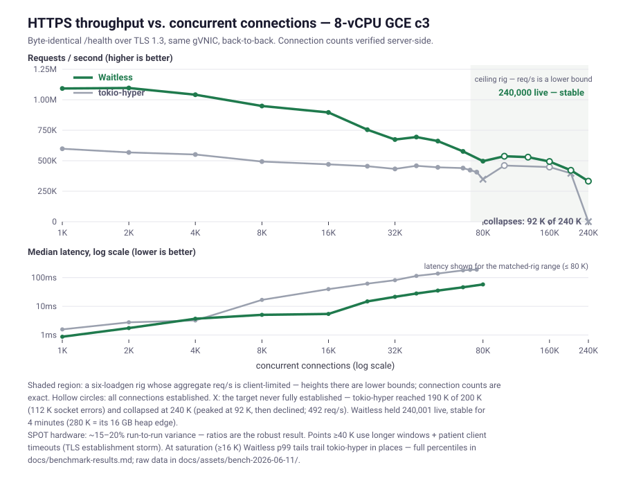

# Waitless

[](#license)

**Waitless is an operating system that boots straight into your app.** It is a
Rust unikernel: there is no Linux underneath, no kernel/user split, and no
syscalls. The NIC driver, TCP/IP, TLS 1.3, HTTP/1.1–3, and your application
code all run in one address space, at one privilege level, driven by one
cooperative `async` runtime. Any network service can be the machine: the
[examples](#examples) include a web server, a SOCKS5 proxy, and an API
gateway — each is just an `async fn` on the same OS.

Delete the kernel boundary and two things fall out — and they're the name,
twice over:

- **Wait**less — `async fn` *is* the scheduler. A handler that waits on a
  socket, a database, or an upstream service parks for almost nothing and the
  core moves on. No thread pool, no syscall to block in.
- **Weight**less — the whole bootable image, OS and all, is **1.5 MB** (a
  hello-world is **428 KB**). Smaller than a typical container's *base layer*,
  with nothing else inside it.

The result — the web-server app on identical cloud hardware against
tokio-hyper, the mainstream Rust async stack on Linux:



> Same NIC, same load generators, measured back-to-back; every connection
> count verified server-side. And Linux runs its mature in-tree `gve` driver;
> Waitless runs a [from-scratch one](crates/drivers/gve/). Linux should win on
> driver maturity alone — it doesn't, because the architecture deletes the
> syscall boundary, the user↔kernel copies, and the context switches outright.

## Try it in 30 seconds

```bash
# Prerequisites: Bazel and QEMU.
#   macOS:  brew install bazel qemu
#   Linux:  your distro's bazel (or bazelisk) + qemu-system packages

bazel run //apps/webserver:webserver_hvf          # macOS — Apple Hypervisor
bazel run //apps/webserver:webserver_qemu_x86_64  # elsewhere — QEMU

# from another terminal:
curl http://localhost:8080/health
```

That command boots a real machine image — kernel, network stack, and web
server — that happens to be 1.5 MB and answers in microseconds.

## Why it's fast where it counts

Most "fast web server" benchmarks serve a static string and measure framework
overhead. Real services don't do that — a real handler **calls a database, a
cache, or another service** and waits on the reply. That is where a unikernel
pulls furthest ahead:

On Linux, an API gateway or backend-for-frontend pays the syscall tax **twice**
per request — once to accept and answer the client, once to connect to and read
from the upstream. Profiled at saturation, tokio-hyper spends **~61 % of its
CPU inside the kernel** doing precisely that (`epoll`, `recv`/`send`, the
in-kernel TCP/IP stack, a copy on every packet). Waitless has no kernel to call:
the inbound serve and the outbound fetch are the same event loop, the same
address space, plain function calls. The ~2× edge on a static response only
grows when the handler does I/O of its own — there's simply more tax to delete.

[`apps/socks`](apps/socks) (a generic SOCKS5 proxy) and
[`apps/gateway`](apps/gateway) (an HTTP backend-for-frontend) are exactly that
handler — see [Examples](#examples).

## Performance

Measured 2026-06-11 on a GCE `c3-highcpu-8` VM with **gVNIC**, driven from two
separate 8-vCPU VMs over the VPC (`wrk`), serving a byte-identical `/health`
over TLS 1.3. Every connection count below is **verified server-side** (live
ESTABLISHED conns), not a load-generator parameter. SPOT hardware carries
**~15–20 % run-to-run variance**, so lean on the **ratios**. Full sweep,
percentiles, and methodology: [docs/benchmark-results.md](docs/benchmark-results.md).

| Concurrent TLS conns | **Waitless** req/s | tokio-hyper req/s | **Waitless** p50 | tokio p50 |
|--:|--:|--:|--:|--:|
|  1,000 | **1.09 M** | 0.60 M | **0.85 ms** | 1.6 ms |
|  8,000 | **0.95 M** | 0.49 M | **4.6 ms** | 17 ms |
| 16,000 | **0.90 M** | 0.47 M | **5.1 ms** | 40 ms |
| 40,000 | **0.69 M** | 0.46 M | **27 ms** | 115 ms |
| 80,000 | **0.50 M** | *failed* | **56 ms** | — |

**The 80,000-connection row is the story.** Under an identical patient-client
protocol, tokio-hyper could not get past ~59,600 established connections
(27 K connect failures); Waitless held **80,001 live TLS connections at
~500 K req/s**. Below saturation the typical request is **4–8× faster**
end-to-end. One honest caveat: at saturation (≥16 K conns) Waitless's p99
*tail* trails tokio-hyper's in places — queueing fairness under overload is
Linux-mature and tracked in the [gaps](#current-gaps--limits). Plain-HTTP
peaks at **0.86 M vs 0.63 M req/s** (≈1.4×).

**Weightless — the whole bootable system, measured:**

| Image (OS + stack + app, bootable) | x86_64 | aarch64 |
|---|--:|--:|
| `apps/hello` (HTTP hello-world)                         | 428 KB | 364 KB |
| `apps/socks` (SOCKS5 proxy — raw TCP)                   | 452 KB | — |
| `apps/webserver` (HTTP/1.1+2+3, TLS, QUIC, diagnostics) | 1.5 MB | 1.2 MB |

No kernel, init, libc, or base image underneath — `--gc-sections` plus
[deps-as-features](#feature-set) means an app links only the protocols it names.

## Examples

| App | What it shows |
|---|---|
| [`apps/hello`](apps/hello) | The smallest Waitless app — bring up the network, serve one route (~25 LOC). |
| [`apps/socks`](apps/socks) | **A SOCKS5 proxy** — `tcp_connect` to a destination the *protocol* chose, then a bidirectional async relay. The high-concurrency story in miniature: it parks on two reads at once while the core serves every other flow. |
| [`apps/gateway`](apps/gateway) | A backend-for-frontend — the handler makes an outbound HTTP request (`http::client::get`) and relays the result: "my handler calls another service." |
| [`apps/webserver`](apps/webserver) | The full demo — HTTPS (h1.1 + h2 + h3 on one port), many routes, live `/obs` diagnostics. |

Here's the heart of the SOCKS proxy — a duplex relay in one task, no threads:

```rust
// After the SOCKS5 handshake dials `target`, relay both directions.
// Each loop parks on BOTH reads; whichever fires is copied to the other side.
async fn relay(client: &mut TcpStream, target: &mut TcpStream) {
    let (mut c2t, mut t2c) = ([0u8; 16 << 10], [0u8; 16 << 10]);
    loop {
        match select(client.recv(&mut c2t), target.recv(&mut t2c)).await {
            Either::Left(0) | Either::Right(0) => return,        // either side closed
            Either::Left(n)  => if target.send_bytes(&c2t[..n]).await.is_err() { return },
            Either::Right(n) => if client.send_bytes(&t2c[..n]).await.is_err() { return },
        }
    }
}
```

The client API is uniform across protocols — `http::client`, `https::client`
(ALPN-negotiated h2/h1.1, or pinned `get_h1`), `http3::client` — each with the
same `connect` / `get` / `fetch` verbs, mirroring the `https::serve` server
facade.

## Writing an application

A Waitless app is a `#![no_std]` Rust crate with an `async` entry point. Here is
[`apps/hello`](apps/hello) in full:

```rust
#![no_std]
extern crate alloc;

use http::{Request, Response};
use waitless::net::Net;

async fn hello(_: &Request, _: &mut http::BodyReader<'_, waitless::runtime::TcpStream>) -> Response {
    Response::ok(b"text/plain", b"Hello from bare metal!\n")
}

#[waitless::init]
async fn init() {
    Net::up().await.expect("Net::up failed");
    http::listen(80, hello).expect("http bind");
}
```

`#[waitless::init]` marks the entry point the runtime polls once the kernel,
drivers, and network are up. The crate's `BUILD.bazel` wires it to the
`waitless_binary` rule:

```python
load("@rules_rust//rust:defs.bzl", "rust_library")
load("//bazel/rules:waitless.bzl", "port_fwd", "waitless_binary")

rust_library(
    name = "app",
    srcs = ["src/main.rs"],
    crate_root = "src/main.rs",
    deps = ["//crates/proto/http", "//crates/waitless"],
)

waitless_binary(
    name = "hello",
    app = ":app",
    drivers = ["//crates/drivers/virtio-net"],
    port_forwards = [port_fwd("tcp", guest = 80, host = 8080)],
)
```

A real application lives in its own repository and depends on Waitless as a
Bazel module — [docs/consuming-as-a-library.md](docs/consuming-as-a-library.md)
is the copy-pasteable checklist.

## Feature set

A research stack, but a broad and real one. Everything below is implemented and
tested (`bazel test //...`); see [Current gaps & limits](#current-gaps--limits)
for what is deferred or unbuilt.

| Area | What's there |
|---|---|
| **Platform** | x86_64 (Multiboot2/Limine) + aarch64; runs on QEMU, Apple HVF, a bootable ISO, GCE, and a POSIX `native` variant — one app, no source changes. SMP: one worker per vCPU, per-core RX/TX queues, Toeplitz RSS. |
| **Runtime** | `async fn`-only cooperative executor; per-core, lock-free, no preemption. Structural cancellation safety (RAII waker dropping); per-core timer wheel with a mockable clock. |
| **NIC drivers** | `virtio-net` (PCI + MMIO) and Google `gve`/gVNIC (DQO + GQI), from scratch. Offloads: TSO, UDP-GSO, RSC/GRO, RSS; zero-copy RX/TX. |
| **L2 / L3** | Ethernet, ARP (+ active resolution for outbound connects), IPv6 NDP, IPv4 & IPv6, DHCP, ICMP, ICMP-driven PMTUD. |
| **TCP** (server + client) | RFC 9293 incl. **active open**; RTO/Karn, IW10, window scaling, SACK + RFC 6675 recovery, out-of-order reassembly, **CUBIC** + NewReno, **TLP** + **RACK**, peer-MSS, RFC 5961 hardening. |
| **QUIC** (server + client) | RFC 9000/9001/9002 — streams, flow control, loss recovery + NewReno + pacing, key update, path validation & migration, RESET_STREAM/STOP_SENDING, client Retry + CID-echo auth, version negotiation. |
| **TLS 1.3** (server + client) | X25519, ECDSA P-256, `TLS_AES_128_GCM_SHA256`, ALPN; server-side 1-RTT resumption; client-side **SPKI pinning**. In-tree AEAD/HKDF, KAT-tested. |
| **HTTP** (server + client) | **h1.1** (streaming bodies, chunked), **h2** (HPACK, flow control, multiplexing + DoS hardening), **h3** (RFC 9114 + QPACK over QUIC). One handler signature serves all three; `https::serve` brings up h1.1+h2+h3 on one port. |
| **Determinism** | The client + server roles run a real client against a real server in one process under a virtual clock + seeded lossy pipe — loss-recovery correctness that used to need a cloud VM + `tc netem`, now a reproducible unit test. |
| **Ops** | Unified `/obs` diagnostics; shared congestion-control core; per-core DRR egress scheduler; admission control; a hardened RNG (SHA-256 Hash_DRBG, SP 800-90A/90B). |
| **Build** | Bazel **deps-as-features** — the app's `deps` list determines what compiles in. Per-runner variant targets; usable as a Bazel module. |

## Current gaps & limits

Waitless is a single-author research project, not production software — the API
is unstable and the checked-in dev certificate and several defaults are
development-only. Known gaps, honestly:

- **Tail latency at saturation trails Linux.** The high-connection sweep is
  now clean (80 K live TLS conns served — see [Performance](#performance)),
  but in the 16–65 K band Waitless's p99 (1.5–4 s) is worse than
  tokio-hyper's in places even while median latency and throughput are far
  better: under overload, Linux's scheduler+TCP queueing degrades more
  fairly. Per-conn scheduling fairness is the open lever.
- **HTTP client: no connection pooling or redirects** — each outbound request is
  a fresh connection. (This is why the proxy-*throughput* head-to-head vs. a
  pooled nginx/tokio gateway is future work; pooling lands first.)
- **IPv6 active open** is IPv4-only so far; **TLS client** does SPKI-pin /
  skip-verify only (no web-PKI chain, no HRR, no client resumption); **QUIC**
  lacks CID rotation and treats a few transport params / a misplaced RESET as
  no-ops rather than strict errors; **HTTP/3** QPACK is static-table only.
- **Linux-parity perf** not yet matched: BBR, a TCP-layer pacer, RACK's adaptive
  window, Timestamps/PAWS, and gVNIC RSS steering for *client* connections.
- **Hardening:** no inbound IP-fragment reassembly or software checksum verify
  (relies on NIC offload); the x86 BSP boot stack lacks a guard page; ARP/NDP are
  learn-only. **Assurance:** `h2spec` / QUIC-Interop aren't in CI; fuzzing is
  smoke-level.

The severity-ranked index is [docs/roadmap.md](docs/roadmap.md) ("Known gaps at
a glance"); the long-term direction is
[docs/architecture-audit.md](docs/architecture-audit.md).

## Architecture

```
┌──────────────────────────────────────┐
│           Application                │  apps/{hello, socks, gateway, webserver}
│         #[waitless::init]            │
├──────────────────────────────────────┤
│   Userspace protos (server + client) │  crates/proto/{tls, http, http2,
│                                      │                http3, quic, https}
├──────────────────────────────────────┤
│ Facade (waitless — kernel↔userspace) │  crates/waitless/ + macros, net, backend
├──────────────────────────────────────┤
│       Network stack                  │  crates/net/ (tcp, udp, ip, stack,
│                                      │              cc — shared congestion ctrl)
├──────────────────────────────────────┤
│     Drivers (NIC + bus)              │  crates/drivers/ (bus, nic, virtio-net, gve)
├──────────────────────────────────────┤
│     Runtime substrate                │  crates/runtime/{platform, worker, executor}
├──────────────────────────────────────┤
│       Kernel (serial, mm, SMP...)    │  crates/kernel/{core, bare}
├──────────────────────────────────────┤
│        Boot / Entry                  │  crates/boot/
└──────────────────────────────────────┘
         x86_64          aarch64
     (Multiboot2/PVH)  (Linux Image/DTB)
```

See [docs/crates.md](docs/crates.md) for the full taxonomy and the
kernel↔userspace facade boundary.

## Build & test

```bash
# Run a variant — pick by name, no --config flags (bazel/rules/variants.bzl):
bazel run //apps/webserver:webserver_hvf            # aarch64 · Apple Hypervisor (macOS)
bazel run //apps/webserver:webserver_qemu_x86_64    # x86_64  · QEMU
bazel run //apps/webserver:webserver_iso_x86_64     # x86_64  · Limine ISO via QEMU
bazel run //apps/webserver:webserver_native         # POSIX sockets · no VM

# Test the full matrix (HVF tests auto-skip on Linux):
bazel test //...
bazel test --test_tag_filters=hvf //...             # or filter by runner
```

The `*_native` variant builds the same app against host POSIX sockets — handy
for fast iteration without a hypervisor.

## Project layout

```
apps/        hello · socks · gateway · webserver — the examples
crates/
  waitless/  the facade apps program against (+ macros, net, backend)
  proto/     userspace protocols, server + client — http, http2, http3, quic, tls, https
  net/       network stack — tcp, udp, ip, stack, cc (shared congestion control)
  drivers/   NIC + bus — virtio-net, gve (gVNIC)
  runtime/   async substrate — executor, worker, platform
  kernel/    serial, memory, SMP, per-core state
  crypto/ util/ boot/   AEAD, zero-copy buffers, arch entry + Limine boot
bazel/       toolchains, platforms, the waitless_binary rule
docs/        architecture & subsystem deep-dives (+ assets/)
scripts/     benchmark, deploy, dev tooling
tools/hvf-runner/   native macOS/arm64 HVF runner for the dev loop
```

## Documentation

Start at **[docs/README.md](docs/README.md)** (categorized index). Highlights:

- [docs/benchmark-results.md](docs/benchmark-results.md) — the numbers in full + how they're measured
- [docs/crates.md](docs/crates.md) — crate taxonomy + the facade boundary
- [docs/stack-architecture.md](docs/stack-architecture.md) — inter-layer contracts
- [docs/architecture-audit.md](docs/architecture-audit.md) — the long-term direction
- [docs/networking.md](docs/networking.md) · [docs/gvnic.md](docs/gvnic.md) — the stack and the NIC driver
- [docs/roadmap.md](docs/roadmap.md) — what's next + the gaps index

## Deploying to GCE

```bash
./scripts/deploy-gcloud.sh deploy        # build the image + create the instance
./scripts/deploy-gcloud.sh logs          # tail the serial console
./scripts/deploy-gcloud.sh purge         # stop / delete
```

Defaults to `c3-highcpu-4` + gVNIC; override with `WAITLESS_GCE_MACHINE`. The
public production build (`--define tls_cert=prod`, via
`scripts/renew-and-deploy.sh`) bakes in the real certificate and compiles out
the development-only client probe endpoints.

## Status

A research project, not production software: enough of TCP/IP, TLS 1.3, QUIC,
and HTTP/1.1–3 to run — and benchmark — a real web server *and* a real client,
but the API is unstable, it's the work of a single author, and the dev
certificate and several defaults are development-only. Issues, questions, and
contributions welcome; the build is plain `bazel test //...`.

## License

Dual-licensed under either of [Apache-2.0](LICENSE-APACHE) or
[MIT](LICENSE-MIT) at your option. Unless you state otherwise, any contribution
you submit for inclusion is dual-licensed as above, without additional terms.
