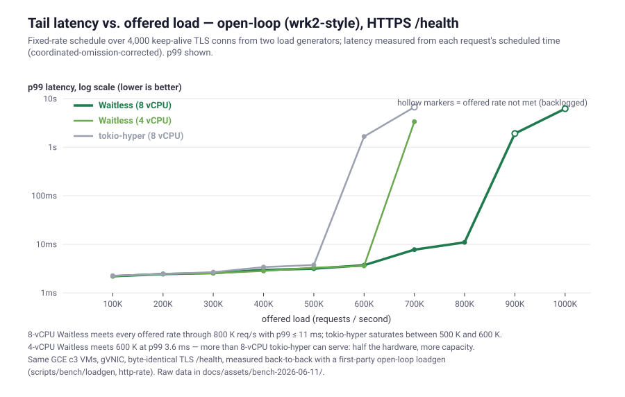

# Benchmark results: Waitless vs tokio-hyper

Waitless is a bare-metal Rust unikernel: no OS, no syscalls — the async
executor *is* the kernel, and it polls the NIC's queues directly. This page
measures what that architecture buys against **tokio-hyper**, the mainstream
production Rust async HTTP stack (tokio + hyper + rustls), on identical cloud
hardware.

It's the most apples-to-apples comparison we can make: same language, same
async model, same TLS-library lineage — the *only* real difference is that one
runs on Linux and one runs on bare metal. (For the comparison against the same
app compiled to run on native Linux/POSIX, see the
[Performance section of the README](../README.md#performance); for how to run
benches, see [`benchmarking.md`](benchmarking.md).)

## TL;DR

Latest sweep (2026-06-11, **8-vCPU `c3-highcpu-8`** + gVNIC, both servers on
matched hardware, two `c3-highcpu-8` load generators, byte-identical
`/health` over TLS 1.3, connection counts **verified server-side**):

- **Peak throughput ≈ 1.8–1.9× tokio-hyper** (1.09 M vs 0.60 M req/s), and
  the lead holds at every measured connection count from 1 K to 80 K.
- **Median latency 2–8× lower** below saturation (5.1 ms vs 40 ms at 16 K
  conns; 0.85 ms vs 1.6 ms at 1 K). At light load (200 conns, an earlier
  session): 270 µs vs 587 µs p50.
- **80,000 concurrent TLS connections served at ~500 K req/s** (80,001 live,
  measured on the server). Under the identical patient-client protocol,
  **tokio-hyper could not establish 80 K** — it plateaued at 59,607 live
  conns with ~27 K connect failures.
- Honest counterweight: at saturation (≥16 K conns) Waitless's **p99 tail is
  worse than tokio-hyper's in places** (multi-second vs 0.3–1.6 s) — Linux's
  queueing degrades more fairly under overload. Tracked in roadmap
  "Known gaps." Plain HTTP/1.1: **0.86 M vs 0.63 M req/s** (≈ 1.4×).

The earlier **4-vCPU `c3`** session is consistent after core scaling:
HTTPS ≈ 610–730 K (Waitless) vs ≈ 338 K (tokio-hyper). All absolutes carry
**~15–20 % SPOT placement variance** — see [Caveats](#caveats); the ratios
are measured back-to-back on the same load generators and are the robust
result.

### The full sweep

`wrk -t8` from two load generators, each driving half the connections.
Points ≥ 40 K use a 75 s window + 30 s client timeout so the TLS
establishment storm (tens of thousands of asymmetric-crypto handshakes in
the first seconds) isn't misread as connect failures; ≤ 32 K uses
30 s + 10 s. `live` is the server's own mid-run established-connection
gauge (`/obs` `live_conns` for Waitless, `ss -s` for tokio-hyper) — the
concurrency claim is a server-side fact, not a wrk parameter.

| conns | **Waitless req/s** | live | p50 | p99 | tokio req/s | live | p50 | p99 |
|--:|--:|--:|--:|--:|--:|--:|--:|--:|
|  1 K | **1,092,710** |    993 | 0.85 ms | 1.4 ms | 598,531 |  1,003 | 1.6 ms | 3.4 ms |
|  2 K | **1,096,585** |  2,001 | 1.7 ms | 2.4 ms | 568,265 |  2,010 | 2.8 ms | 9.8 ms |
|  4 K | **1,041,377** |  4,001 | 3.7 ms | 4.8 ms | 551,301 |  4,011 | 3.2 ms | 26 ms |
|  8 K |   **949,083** |  8,003 | 4.6 ms | 0.52 s | 493,093 |  8,010 | 17 ms | 62 ms |
| 16 K |   **895,804** | 16,004 | 5.1 ms | 1.6 s | 470,299 | 16,008 | 40 ms | 0.33 s |
| 24 K |   **754,556** | 24,007 | 15 ms | 0.47 s | 454,909 | 24,007 | 62 ms | 0.80 s |
| 32 K |   **673,869** | 31,988 | 21 ms | 0.40 s | 432,847 | 32,007 | 81 ms | 1.4 s |
| 40 K |   **694,153** | 40,001 | 28 ms | 0.30 s | 458,790 | 40,007 | 115 ms | 0.45 s |
| 50 K |   **661,202** | 50,001 | 35 ms | 1.6 s | 445,745 | 50,006 | 139 ms | 1.5 s |
| 65 K |   **576,457** | 64,993 | 46 ms | 2.4 s | 439,945 | 64,999 | 179 ms | 1.6 s |
| 80 K |   **496,725** | **80,001** | 58 ms | 3.9 s | 348,325 | **59,607** † | — | — |

† tokio-hyper at 80 K: 26,807 connect + 33,010 write + 10,114 read errors
across the two load generators — it never reached 80 K established, so its
req/s and latency in that row aren't comparable (fewer, churning conns).
Raw per-point JSONL: [`assets/bench-2026-06-11/`](assets/bench-2026-06-11/).
Reproduce with [`scripts/bench/conn-sweep.sh`](../scripts/bench/conn-sweep.sh);
render with [`scripts/bench/chart_sweep.py`](../scripts/bench/chart_sweep.py).

Reading the 4 K row carefully: it is the one point where tokio-hyper's
*median* beats ours, and it is closed-loop arithmetic, not service speed —
both re-measured in isolated 60 s runs and stable. At 4 K conns Waitless
completes 1.04 M req/s, so by Little's law each round-trip averages
~3.8 ms with a tight distribution (p99 4.8 ms). tokio-hyper completes
551 K req/s on the same connections — its *mean* must be ~7 ms, and its
faster-looking 3.2 ms median is paid for by a fat tail (p99 26 ms). At
equal load (any row where both are unsaturated) Waitless's median is
strictly lower.

### The connection ceiling

How far does concurrency actually go? Answered in two rounds; per-shot
data in
[`assets/bench-2026-06-11/max-conns.md`](assets/bench-2026-06-11/max-conns.md).

**Round 1 — three 8-vCPU load generators** (the c3 quota caps two; the
third rode the n2 quota), task arena at 32 K slots/worker (`0292a82`):
**143,164 live TLS connections at ~700 K req/s** — limit demonstrably
the *clients*, not the server: across every probe `pool_exhausted=0`,
`spawn_failures=0`, heap at 2–3 GB of 16 GB, throughput steady.

Two client-side mechanisms bound that round, both instructive:

- **Loadgen ephemeral ports don't recycle against us.** Linux
  `tcp_tw_reuse` needs TCP timestamps, which Waitless deliberately defers
  (tcp-backlog T6) — so a loadgen that churns connections holds each port
  in TIME_WAIT for 60 s. One of the three loadgens entered each shot with
  a depleted pool and consistently lost ~30 K conns to connect timeouts.
  A real fleet of clients (each its own IP) doesn't share this constraint;
  it's also a measured argument for landing T6.
- **Churn collides with its own orphans.** A client that abandons a slow
  handshake and retries from a recycled port hits its *own* half-dead
  connection on the server; RFC 5961 correctly answers with a
  (rate-limited) challenge ACK rather than accepting the SYN — the
  behavior that protects live connections from blind RST/SYN attacks.
  Linux does the same; under this synthetic 3-IP herd it reads as
  establishment slowness.

**Round 2 — six 4-vCPU load generators** (each driving only N/6 conns,
far below any per-IP port ceiling — which made every round-1 client
pathology vanish), against the per-core TCP 4-tuple hash doubled to 64 K
entries (`0e435b8`, sized for 25 K+ conns/core):

| target | live conns @ 90 s / 150 s / 210 s | sum req/s |
|--:|---|--:|
| 200 K | 199,995 / 199,995 / 199,995 | 421 K |
| **240 K** | **240,316 / 240,002 / 240,001** | 332 K |
| 280 K | *server died* | — |

**240,000 live TLS connections, rock-stable for four minutes** — 30 K
conns per core on an 8-core/16 GB VM, every count read from the server's
own gauge, ~1.7 K total socket errors across 80 M requests. (The lower
req/s vs the c3-loadgen runs is the weak e2 clients, not the server —
closed-loop p50 ≈ 240 ms at 240 K conns.) The 100 K / 128 K / 160 K
points on the same rig land exactly and hold (99,987 / 127,995 / 159,986
live; 537 K / 529 K / 494 K req/s).

**And the edge is real: 280 K kills the server.** The guest
self-terminates (panic → shutdown), reproduced twice — consistent with
heap exhaustion (~280 K × ~55 KB/conn ≈ the full 16 GB) reaching an
allocation site the 90 %-heap admission guard doesn't cover (serial
capture wasn't enabled, so the exact site is unconfirmed). Tracked as a
roadmap gap: extreme-connection-count OOM must degrade to refusing new
connections, not shutting down. The honest ceiling statement: **stable
at 240 K, fatal by 280 K; the next lever is per-conn memory** (rx_ring
tiering / the arena arc, architecture-audit #6).

**Fairness check — tokio-hyper on the same six-loadgen rig.** Its 80 K
failure above was rig-specific: re-measured with six client IPs,
tokio-hyper serves 100 K and 160 K cleanly (99,990 / 159,991 estab,
460 K / 449 K req/s) — it does **not** have a ~60 K ceiling in general,
and round 1's framing implied more than it should have. The fair deltas
on identical rigs: at 200 K tokio-hyper never converges (190,337 of
200 K, 41 K connect + 71 K read errors, still climbing at t=210 s) and
at **240 K it collapses metastably** (established peaks at 91,932 and
*declines* to 73,409; 492 req/s; client p50 22–31 s) — where Waitless
holds 240,001 without drama. On the harsher two-IP rig, Waitless established
all 80 K while tokio-hyper stalled at 59,607: the same establishment-storm
robustness, shown at two scales.

### Latency under offered load (open-loop, wrk2-style)

The sweep above is closed-loop (wrk): a slow server slows its clients, so
saturation latency partly hides queueing. This section is the stricter
open-loop measurement: a first-party fixed-rate loadgen
([`scripts/bench/loadgen`](../scripts/bench/loadgen), `http-rate`
workload) fires requests on a fixed schedule across 4,000 keep-alive TLS
conns (2,000 per loadgen) and measures every latency **from the request's
scheduled time** — coordinated-omission-corrected, like wrk2. Each point
is 30 s + 5 s warmup, both servers back-to-back on the same loadgens.

| offered req/s | **Waitless 8c** p99 | **Waitless 4c** p99 | tokio-hyper 8c p99 |
|--:|--:|--:|--:|
| 100 K | 2.3 ms | 2.2 ms | 2.3 ms |
| 300 K | 2.6 ms | 2.5 ms | 2.7 ms |
| 500 K | 3.2 ms | 3.3 ms | 3.8 ms |
| 600 K | 3.7 ms | **3.6 ms** | *1.7 s — saturated* |
| 700 K | 7.8 ms | 3.4 s — saturated | 6.7 s |
| 800 K | **11 ms** | — | — |
| 900 K | saturated | — | — |

Readings:

- **Below everyone's knee, latency is near-identical** (~2–4 ms p99 for
  all three) — the syscall tax shows up as *capacity*, not as per-request
  latency at low load.
- **The knees: tokio-hyper ≈ 550 K, Waitless-4c ≈ 650 K, Waitless-8c
  ≈ 850 K.** Once an open-loop arrival rate exceeds capacity, backlog
  grows without bound — the multi-second "latencies" past each knee are
  queue depth, not service time (hollow markers in the chart).
- **The 4-vCPU row is the cost claim: half the hardware out-serves
  tokio-hyper's eight cores.** 600 K req/s at p99 3.6 ms on 4 vCPUs vs
  tokio-hyper failing to meet 600 K on 8.
- Zero request errors at every met rate, all three servers.

### Boot time and footprint

Measured on Apple HVF (the dev runner), three runs: **guest boot to
serving — kernel, NIC driver, TCP/IP, TLS init, listeners bound — takes
~3 ms** (serial-stamped `ready` at 0.0028–0.0032 s); launch-to-first-
HTTP-200 including hypervisor + image load is ~120 ms warm. The bootable
image is 1.5 MB; the booted system idles at ~2 MB of heap. (GCE boots
currently add a ~10 s DHCP wait — the first DISCOVER's reply is missed
and the retry loop is slow; tracked in the roadmap.)

**Memory per connection — honest numbers** (measured at 50 K live TLS
conns): Waitless ≈ 55 KB/conn (heap; the fixed 16 KB per-conn RX ring
dominates), Linux+tokio-hyper ≈ 38 KB/conn (1.51 GB process RSS + 192 MB
kernel TCP buffers). Per-conn memory is **not** currently a Waitless
advantage — rx_ring tiering (architecture-audit #6 territory) is the
lever. The footprint advantage is the *system*: megabytes idle vs a
full Linux userland + kernel.

### What the sweep flushed out (fixed the same day)

The first pass of this sweep collapsed at 4–8 K connections — and the causes
were **Waitless bugs**, not load-generator artifacts (the previous edition of
this page guessed "likely loadgen-edge"; `/obs` said otherwise):

1. **Timer-wheel slot overflow fired 30 s timeouts instantly** (`afa411c`).
   The per-worker wheel capped each of its 256 hash slots at 8 timers;
   thousands of keep-alive conns re-arming 30 s recv timeouts in the same
   microsecond overflowed slots, and the overflow fallback fires the Sleep
   immediately — mass-closing *live* connections (1.17 M `idle_timeout`
   closes in one 30 s bench) and feeding a reconnect→handshake storm.
   Wheel slots now spill to the heap, with a per-slot min-deadline so
   `advance` skips far-future slots in O(1).
2. **Task-arena exhaustion starved accepted conns past 32 K** (`7d6756a`).
   4096 task slots/worker = a hard 32,768-task machine ceiling: at 40 K
   conns, accepted TCP connections couldn't get a handler task, so TLS
   handshakes never ran (1.29 M conns established, 218 K handshakes
   completed) and clients timed out in connect. Now 16 K slots/worker.
3. **The enabler: the kernel claimed 3 GB of the c3's 16 GB** (`39661ec`).
   The boot identity-map stops at 4 GiB and heap init skipped higher
   regions even on the Limine/GCE path where the HHDM maps them. At ~55 KB
   per TLS conn that capped memory at ~34 K conns; with the full 16 GB the
   memory ceiling is ~290 K conns — CPU is the binding limit again.

## Why — the syscall tax

Profiled at saturation, **tokio-hyper spends ≈ 61 % of its CPU in the kernel**
(`vmstat` system time) and only ≈ 38 % in user code, at 99 % CPU utilization.
That kernel time *is* the POSIX boundary: `epoll`, `recv`/`send` syscalls, the
in-kernel TCP/IP stack, and the user↔kernel copy on every packet.

Waitless has no kernel to call. Its TCP, TLS 1.3, and HTTP/1.1 stacks live in
the same address space as the request handler, inside one cooperative async
executor that polls the gVNIC RX/TX queues directly — no syscall, no ring
transition, no context switch, no kernel-boundary copy on the request path.
Deleting that ≈ 61 % is most of what shows up as the ~2× gap.

Where Waitless's *own* per-request cycles go (4 vCPU, TLS, saturated, from the
`/obs` cycle counters — see [`observability.md`](observability.md); roughly,
these also move with placement):

| Bucket | ~Share | What it is |
|---|--:|---|
| Transport (TCP RX + send + gVNIC driver) | ~37 % | the bare-metal packet path |
| Async-runtime plumbing | ~28 % | recv-chunk pump + task poll/dispatch |
| TLS 1.3 AES-GCM | ~23 % | record encrypt + decrypt |
| HTTP/1.1 parse + response build | ~12 % | |

No syscall line in that table — that's the point. (Crypto being only ~23 % is
why the TLS penalty is modest.)

## Scaling 4 → 8 vCPU

The headline sweep above is 8-vCPU. The earlier 4-vCPU session showed the
same ~2× ratio (TLS ≈ 610–730 K vs ≈ 338 K), i.e. the lead is not a
core-count artifact. Waitless's TLS path scaled ~1.5× from 4→8 vCPU
(sub-linear — there is multi-core contention to chase); the plain path was
loadgen-capped at both sizes.

## Setup & methodology

- **Hardware:** GCE `c3-highcpu-4` / `c3-highcpu-8`, gVNIC, `us-west1-c`, SPOT.
  Same VM shape for both servers in each comparison. (`c3-highcpu-4` is now the
  default deploy shape — `scripts/deploy-gcloud.sh` — since 4 vCPU already
  clears 1 M rps plain.)
- **Servers:** Waitless (this repo, bare-metal unikernel image) vs
  `tokio-hyper` — a release build on Debian, tokio multi-threaded runtime (one
  worker thread per vCPU), rustls. Both serve the **byte-identical** `/health`
  JSON, verified for parity.
- **Load:** `wrk -t8` (keep-alive) from two separate `c3-highcpu-8` GCE VMs
  over the VPC — no loopback shortcut for either server. The sweep drives
  half the target connections from each loadgen
  ([`scripts/bench/conn-sweep.sh`](../scripts/bench/conn-sweep.sh)); loadgen
  prep = 1 M fd limit + full ephemeral-port range. High-conn points (≥ 40 K)
  use a 75 s window + 30 s client timeout — with wrk's default-ish 10 s
  timeout, the initial TLS-handshake storm at 80 K conns reads as tens of
  thousands of bogus "connect errors" on *both* servers.
- **Server-bound, not loadgen-bound.** A single 8-vCPU `wrk` host tops out near
  ~800 K rps plain / ~580 K TLS — *below* what Waitless sustains, so a
  one-loadgen run measures the load generator. (A flattering fact: a 4-vCPU
  Waitless out-serves what an 8-vCPU `wrk` client can generate.) tokio-hyper
  saturates its cores well under that ceiling — it's CPU-bound at one loadgen,
  so adding a second only adds contention; Waitless needs two. Each server is
  therefore reported at *its own* saturation, verified with `/obs` `idle≈0` and
  cross-checked against the server's own `requests_parsed` counter (a hard
  server-side count, not a wrk estimate).
- **Reproduce:** [`scripts/bench/twolg.sh <server-ip> <label> <proto>`](../scripts/bench/twolg.sh)
  drives both loadgens and sums throughput; per-request CPU via
  [`scripts/profile_obs.py`](../scripts/profile_obs.py) against two `/obs`
  snapshots.

## What the throughput gap is *not*

It is **not** primarily a clever waitless optimization. While chasing it we
removed a redundant per-request heap allocation in the TCP retransmit path
(2 → 1 allocs/req; ~40 % off the send-path cycles — commit `e284d00`). A
same-session A/B at saturation showed that change is a real *per-request*
saving but its *throughput* effect (~6 % of the cycle budget) is **smaller than
the ~15–20 % placement variance** — i.e. a legitimate micro-optimization, not
the reason Waitless wins. The win is the architecture (no syscalls), which is
why it's ~2× and not ~1.06×.

## Caveats — read these

- **Run-to-run variance is ~15–20 %** on SPOT shared-tenant hardware: the same
  image re-deployed landed at 729 K TLS one session and ~610 K the next. We
  report ranges and lean on the *ratio* (measured back-to-back, same loadgens,
  tokio-hyper verified CPU-bound) rather than any single absolute.
- **Small-response keep-alive `/health`** — this measures per-request
  *overhead*, the regime where the syscall tax dominates. Bulk transfer or
  compute-heavy handlers spend their time elsewhere and will narrow the gap.
- **Low-RTT LAN/datacenter path** — these runs are co-located VMs on one
  VPC (sub-millisecond RTT), where TCP congestion control barely engages
  and our no-syscall architecture wins ~2×. On a **high-RTT or lossy WAN
  path the comparison narrows or inverts**: tokio-hyper inherits the Linux
  kernel's mature CC and loss recovery (CUBIC/BBR, packet pacing,
  RACK-TLP, ABC), whereas our hand-rolled stack is RFC 5681 Reno with no
  pacing and RTO/3-dup-ACK recovery only. Those gaps — the cost side of
  the no-kernel architecture — are inventoried under *Performance parity
  with the Linux TCP stack* in
  [`tcp-backlog.md`](tcp-backlog.md). This page
  measures the regime where we win; it is not a WAN claim.
- **Plain-HTTP Waitless figures are lower bounds** — we could not fully saturate
  Waitless's plain path within the GCE vCPU quota (two load generators).
- **One run per sweep point** (30–75 s each). The low-conn points were
  reproduced within ~1 % across the three same-day sweeps; treat any single
  high-conn point as ±placement-variance.
- **p99 at saturation favors tokio-hyper in places** (see the sweep table) —
  when every core is pegged, our cooperative scheduler currently lets some
  requests queue far longer than Linux's preemptive scheduler + kernel TCP
  would. Median and throughput favor Waitless throughout; the tail is the
  open gap.
- **tokio-hyper is an idiomatic baseline** (release, rustls, multi-thread
  runtime), not a hand-tuned record-chaser — a reasonable stand-in for "a
  competent Rust async server on Linux."

## Efficiency baselines (folded from the 2026-06 efficiency audit)

> `efficiency-audit.md` retired 2026-06-10; its full narrative (the
> 2026-05-28 static audit, the 2026-05-30 falsification pass, the
> 2026-06-09 re-measurement) is in git history. This section keeps the
> standing measured baselines + the do-not-redo findings. Dated numbers
> are snapshots — re-measure before trusting an absolute.

### Measurement traps (don't repeat them)

A multi-URL `curl -o /dev/null url url …` does **not** issue one request
per URL against this server, and the bench harness's `allocs/iter` is a
*net live-count* delta (allocs − frees ≈ 0 in steady state), not
cumulative — both produced bogus "0 allocs/req" readings. Count
client-verified keep-alive responses against the cumulative `/obs`
`heap_total_allocation_count`.

### Allocs/request (measured, client-verified; HVF/virtio)

| Path | allocs/req | What they are (code-traced) |
|---|---|---|
| h1-TLS `GET /health` | **1.00** | the rtx retain — `rtx_push`'s `into_owned()` of the sealed record, freed on ACK. (`RtxPayload::Inline` reached 0/req, measured throughput-neutral, deliberately reverted) |
| h1-TLS `/static-16k` | **2.02** | + 1 TSO-record retain |
| h1-TLS `/static-1m` | **81** | ≈ 1 retain per 16 KiB TSO record + record chunking |
| h2 `GET /health` | **1.25** | (`de60f15`) header_block pools through StreamOut retirement; Borrowed-IOBuf flush |
| h3 `GET /health` | **6.0** | (`68080c5`, was 8.4) stream-retx now `clone_shared` views; remaining: BTreeMap node churn + DATA-header IOBuf |

RX is structurally zero-copy / zero-alloc on all paths (chunk move →
in-place AEAD → in-place parse).

### Memory per connection (measured + compiler-exact decomposition)

- **Idle system heap**: 1.86 MB / 374 live allocations after boot (HVF,
  1 core). Dominant per-core statics: `TCP_HASH` 328 KB, accept rings
  66 KB; NIC queue DMA ~1.5–2.5 MiB/QP.
- **h1-TLS conn (deployed `https` facade)**: **≈ 67 KB idle established**
  / ≈ 84 KB after the first request (+16.4 KB lazy `record_scratch`).
  Decomposition: rx_ring 16.4 KB + `TlsConnImpl` 7.9 KB + serve-task
  future ~20.4 KB + ~22 KB unattributed (likely `rx_partial`
  materialized by a handshake-flight straddle). ⚠ `H2Conn` heap is
  h2-ALPN-only — attributing it to every TLS conn was a measured,
  corrected mistake.
- **h3/QUIC conn**: `Connection` 17,944 → **4,008 B** after the DirKeys
  boxing (`b513437`); the four per-conn Rcs co-allocate into one
  4,080-B `ConnArena` (`b055a26`, 4 → 1 allocs/conn).
- **TCP slot**: `TcpConnection` = 384 B; pool segment 24.6 KB / 64
  slots, lazy.
- **No unbounded growth paths**: every queue is capped (OOO 16 KB/conn,
  retx ≤ cwnd ≤ 2 MiB, CRYPTO reassembly 64 KB, h2 1 MiB recv / 256 KiB
  send per stream, QUIC 2 MiB/stream / 8 MiB/conn / 256 MiB global,
  conn inbox 256 datagrams, per-IP half-open 256, refuse-at-90%-heap).

### Single-loadgen workload snapshot (GCE 2026-06-09, c3-highcpu-4 DQO)

| Workload | 1c | 2c | 4c | Notes |
|---|---|---|---|---|
| `get_tcp` (plain /health) | 182.5K | 327.2K | 536.9K | |
| `get_tls` (TLS /health, 32c) | 114.9K | 207.1K | 357.1K | cy/B 9.8–10.0 |
| `get_h1` | 347.4K | 428.5K | 482.6K | 4c **client-bound** |
| `get_h2` | 324.3K | 419.1K | 482.0K | h1-parity; client-bound |
| `get_h3` | 185.5K | 237.6K | 301.9K | ≈ 0.63× h1 |
| `get_tcp_fresh` (conn/s) | 36.4K | 64.1K | 99.2K | |
| `get_tls_fresh` (full hs/s) | 3.8K | 5.2K | 6.2K | |
| `download_64k_tls` | 23.6K | 35.6K | 36.5K | **NIC-bound ≥2c** (2.3–2.4 GB/s) |
| `download_64k_quic` | 10.0K | 12.1K | 13.2K | 659–864 MB/s |
| `upload_32k_tls` | 41.3K | 52.8K | 54.2K | 1.4–1.8 GB/s RX |
| `get_tcp_single` (1-conn RTT) | p50 49 µs | 48 µs | 49 µs | |

The 4c h1/h2 numbers are a floor (single loadgen saturates first); the
two-loadgen saturated reference is the TL;DR table above.

### The falsified thesis (do-not-redo)

The audit's original "global heap lock = #1 lever" thesis was **measured
false**: a per-core magazine allocator made the hot allocs 99.95%
lock-free on the contended gve-8c path and bought **~0 throughput**
(576K OFF vs 570K ON; branch `perf/tls-beat-tokio` preserves it).
Under true saturation all 8 cores are 99.7–99.8% busy, perfectly
balanced — already shared-nothing. Saturated cycle split: NIC driver
~39%, async-dispatch ~22%, TLS ~17%, HTTP ~10%, tcp_send (incl. the
1 alloc) 6%. Alloc/copy micro-work targets <10% of cycles — efficiency
wins, not throughput levers.

### What's already optimal (do not re-touch)

RX zero-copy; the rtx_queue `VecDeque` migration (155→88 KB/conn); the
TCP hot/cold struct split was tried and **rejected** (3–19% worse);
accept + steady-state wakes are same-core; c3/gVNIC runs Tier 1
(per-core RX queues).

### Open efficiency levers (allocs/bytes, not throughput)

- **rx_ring 16 KB → tiered** (default 4–8 KB, grow lazily): −8–12
  KB/conn; `OOO_MAX_BYTES` is tied to it. Biggest always-present block.
- **`[Header;16]` 5.4 KB → 8 inline + overflow**: −3–4 KB/conn, also a
  per-stream cost in every spawned h2/h3 handler task.
- **Pool/shrink the TLS scratches** (`record_scratch`/`rx_partial`
  16 KB): held `&mut` across `.await` → needs a drop-returned guard.
- **Per-request shared `Counter`s → `PerCoreCounter`**; pad the gve
  per-QP counter array (false sharing at packet rate). Low risk.
- **ConnArena long arc**: typed arena regions for the dynamic conn
  state — architecture-audit #6.
